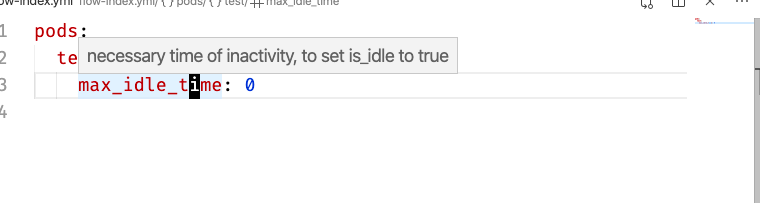

# Test for Using JSON Schema for Autocompletion/Validation for jina flow yml Files -WIP


Currently only an experiment.

Example for autocompletion: 

Example for getting quick explanation for property on hover:


## How to try
Install Red Hat yaml extension for vscode from 
https://marketplace.visualstudio.com/items?itemName=redhat.vscode-yaml
or by 
```bash
code --install-extension redhat.vscode-yaml
```

and reference the schema file to your editor's `settings.json`
```json
  "yaml.schemas": {
    
    "./flow.schema.json": [
      "flow-index.yaml",
      "flow-query.yaml",
      "flow-query.yml",
      "flow-index.yml"
    ]
  }
```
  (it seems like it's not possible to use advanced globbing features for file matching)

## Todo
- provide More Complete Schema
- add description properties to provide more information/support on hover inside the editor
- evaluate how to deal with custom tags like `!Flow` in JSON schema, instead of requiring to customize extension settings 
- clean schema, reuse/reference where it leads to improved maintainability and simplifies readability 

Contributions/help are always welcome.

## Goals
If a comprehensive schema with documentation/hints is available via the [JSON Schema Store](https://www.schemastore.org/) autocompletion and quick documentation will be automatically available to vs code users. 